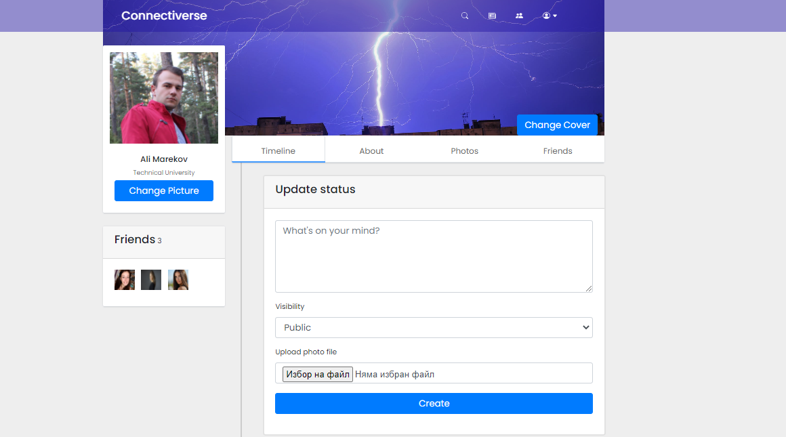
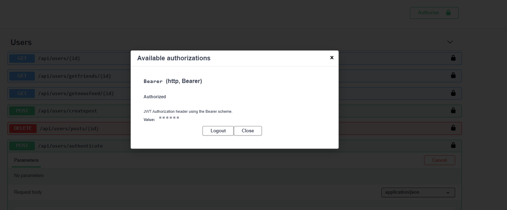

# Connectiverse

 
Connectiverse is a social network application, enabling users to share media and communicate with their friends.
 
 

 
 

The main features of the application are:
- create new connection by adding a user to friend list
- create a post with a range of visibility types (public, friends, private)
- like and/or comment on a personal/friend's post
- send/receive text messages via real-time chat
- search for users
- remove a connection

 

## :handshake: Authors

- [Magdalena Nikolova](https://gitlab.com/maginikolova)
- [Ali Marekov](https://gitlab.com/marekov)
 

# :construction_worker: Built with:

 

- ASP .NET Core
- ASP .NET Core Identity
- MS SQL Server
- Entity Framework Core
- AutoMapper
- ASP .NET Core WebAPI
- Swagger
- JWT
- JavaScript/jQuery/AJAX
- HTML5/CSS3/Bootstrap
- SignalR
- Azure blob storage
- NewsAPI
- Moq

 

# Areas

 

- Public - users are only allowed to register or log in
- Private - available after registration
- Administrative - available for admins only
- API

 

# Public part

The public part consists of the home page, displaying real-time statistics about the application.

 
 

# Private part

The private part supports a large variety of functionalities:

- add a post, set post visibility, attach a photo to a post;
- send/accept/decline a friend request;
- remove a friend;
- like/dislike/comment on a personal/friend's post
- change profile/cover picture;
- browse newsfeed;
- search for user/users;
- look up user's public profile information;
- access to the public chat room;
- browse resources provided by a 3rd party api - NewsAPI;

 

This is how the application looks once a user signs in:

 
Once a user goes to the news feed, a list of the user's friends' posts will be displayed along with the likes/comments count of each post:

 
You can select who can view your posts:

 
Every person has their own gallery, where each of their photos can be viewed:

 
If a user chooses not to see another user's posts, an unfriend option is available, with an option to become friends once again:

 
A user is able to search for other users and to sort the results by a number of criterias:

 
When a new user enters the chat room, he is able to send and receive real-time messages with other participants. Here, the participants are planning on taking part of a hackaton. The chat section is accessible anywhere in the application:

 
The application is connected to a 3rd party api, which provides the hottest and most up-to-date news on a topic, also available anywhere within the application:

 
 

# Administration part

The administration part of the application is provides authorized users with additional rights, apart from the ones already listed above, available for ordinary users only. The additional rights are:

- List all users/posts/comments
- Delete post/comment/user
- Edit post/comment

Only authorized users can access the admin panel, once they log in, they can see it included in the profile options menu:

 
 

# API

The REST API supports the functionalities listed below:

 

 

In order to send a request, the user has to prove their identity as they perform the "authenticate" method. In order to do so, vali login credentials are required:

 

Once the login action is successful, a JW Token is generated, so that it is used for authorization:

 

Now that the authorization is complete, the server returns a response to a request, containing the JWT:

